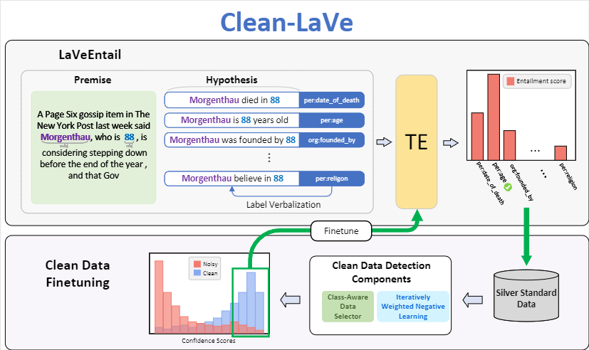

# On the use of Silver Standard Data for Zero-shot Classification Tasks in Information Extraction
Source code for LREC-COLING 2024 paper titled "[On the use of Silver Standard Data for Zero-shot Classification Tasks in Information Extraction](https://arxiv.org/abs/2402.18061)".
<div align="center">
  

  **Figure 1:** The diagram shows the procedure of Clean-LaVe in the zero-shot relation extraction task
</div>

- We propose Clean-LaVe to first detect a small amount of clean data which are later used to finetune the pre-trained model. We then use the finetuned model to infer the categories on the test data.
- We propose a clean data detection module that enhances the selection process through Iteratively Weighted Negative Learning and Class Aware Data Selector.
- The experimental results demonstrate that our method can outperform the baseline by a large margin on various zero-shot classification tasks


## Requirements
Install the necessary packages with: 
```
$ pip install -r requirements.txt
```


## Usage
- There three infomation extraction task (RE, EAC and multi-lingual RE).\
(For more detailed information, please consult the paper.)

- Correspondence between directory and tasks:
    ```
    RE task: ./Clean_LaVe4RE
    EAC task: ./Clean_LaVe4EAC
    Multi-lingual RE: ./Clean_LaVe4REMul
    ```

- For conducting Clean-LaVe on these three information extraction task, pls refer to the readme.md file under the corresponding directory.


## Dataset
- We have released a pre-processed dataset on https://huggingface.co/datasets/wjwilliam/Clean_LaVe to ensure reproducibility.
